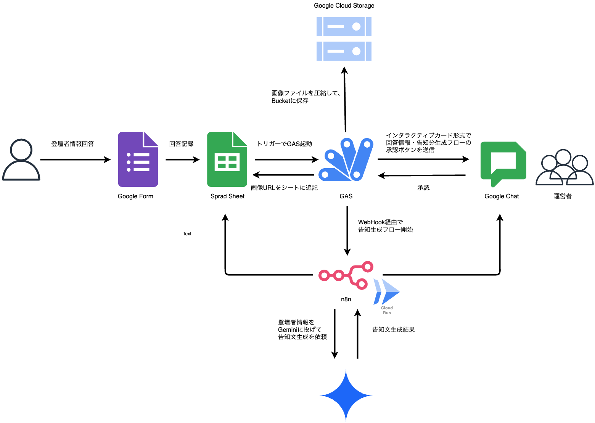
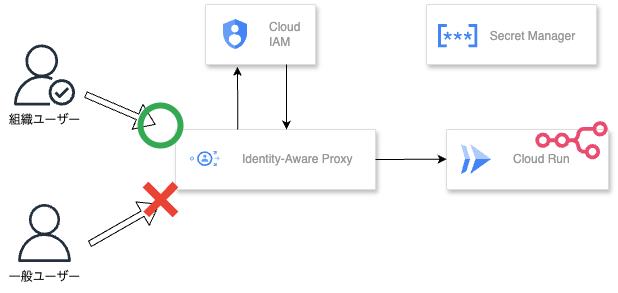
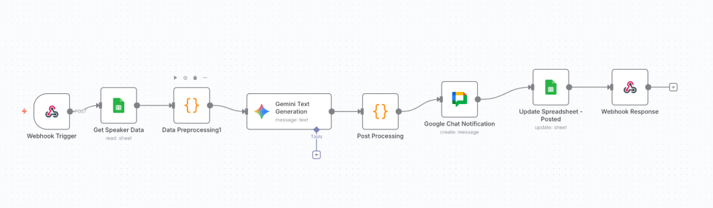

# 登壇者情報告知自動化ワークフロー

Google Form で収集した登壇者情報から、LLM を活用して SNS 告知文を自動生成する n8n ワークフローシステムです。

## プロジェクト概要

### 目的

イベントの登壇者情報を効率的に収集・管理し、承認フローを経て自動的に SNS 告知文を生成・投稿するシステムを構築します。

### 主な機能

- **登壇者情報の自動収集**: Google Form による情報収集
- **承認フロー**: Google Chat を活用した承認プロセス
- **AI による告知文生成**: Gemini API を使用した SNS 投稿文の自動生成
- **画像管理**: Google Cloud Storage による登壇者画像の管理
- **ワークフロー自動化**: n8n による処理の自動化

## システム構成

### アーキテクチャ図







### コンポーネント詳細

| コンポーネント               | 役割                         | 技術スタック     |
| ---------------------------- | ---------------------------- | ---------------- |
| **Google Form**              | 登壇者情報収集               | Google Forms     |
| **Google Spreadsheet**       | データ管理・中央データベース | Google Sheets    |
| **GAS (Google Apps Script)** | データ加工・トリガー処理     | JavaScript       |
| **Google Cloud Storage**     | 画像ファイル管理             | GCS              |
| **n8n**                      | ワークフローエンジン         | Cloud Run v2     |
| **Gemini API**               | SNS 告知文生成               | Google AI Studio |
| **Google Chat**              | 承認フロー・通知システム     | Google Chat API  |

## ワークフロー詳細

### 1. 情報収集フェーズ

1. **登壇者応募**: Google Form で登壇者情報を収集
2. **データ保存**: Google Spreadsheet に情報を自動保存
3. **画像アップロード**: 登壇者画像を Google Cloud Storage に保存

### 2. 承認フェーズ

1. **承認リクエスト**: GAS が Google Chat に承認リクエストを送信
2. **承認処理**: 管理者が Google Chat で承認/却下を決定
3. **ステータス更新**: Spreadsheet の承認ステータスを更新

### 3. 告知文生成フェーズ

1. **ワークフロー起動**: 承認された登壇者情報で n8n ワークフローを起動
2. **データ統合**: Webhook データと Spreadsheet データを統合
3. **AI 生成**: Gemini API で SNS 告知文を生成
4. **結果返却**: 生成された告知文を GAS に返却

### 4. 投稿フェーズ

1. **告知文確認**: 生成された告知文を確認
2. **SNS 投稿**: Twitter、LinkedIn 等への投稿実行
3. **完了通知**: Google Chat に完了通知を送信

## ディレクトリ構成

```text
announce-workflow/
├── README.md                   # プロジェクト全体の概要
├── AGENTS.md                   # AI エージェント設定
├── compose.yml                 # Docker Compose 設定
├── supabase.env                # Supabase 環境変数
├── docs/                       # ドキュメント
│   ├── diagram/                # アーキテクチャ図
│   ├── few-shot/               # Few-shot プロンプト例
│   └── template/               # テンプレートファイル
├── gas/                        # Google Apps Script
│   ├── src/                    # ソースコード
│   ├── dist/                   # ビルド済みファイル
│   └── config.template.json    # 設定テンプレート
├── n8n/                        # n8n ワークフロー
│   └── workflows/              # ワークフロー定義
└── terraform/                  # インフラストラクチャ
    ├── resource_modules/       # リソースモジュール
    ├── infra_modules/          # インフラモジュール
    └── composition/             # 環境別設定
```

## 技術仕様

### フロントエンド

- **Google Forms**: 登壇者情報収集フォーム
- **Google Sheets**: データ管理と表示
- **Google Chat**: 承認フローと通知

### バックエンド

- **Google Apps Script**: サーバーレス処理
- **n8n**: ワークフローエンジン（Cloud Run v2）
- **Supabase**: PostgreSQL データベース

### AI・機械学習

- **Gemini API**: テキスト生成
- **Few-shot Learning**: プロンプトエンジニアリング

### インフラストラクチャ

- **Google Cloud Platform**:
  - Cloud Run v2 (n8n)
  - Cloud Storage (画像管理)
  - Secret Manager (認証情報管理)
- **Supabase**: PostgreSQL データベース

## セットアップ手順

### 1. 前提条件

- Google Cloud Platform アカウント
- Supabase アカウント
- Google AI Studio API キー
- Terraform 1.0 以上

### 2. インフラストラクチャ構築

```bash
# Terraform でインフラを構築
cd terraform/composition/asia-northeast1/prod
cp terraform.tfvars.sample terraform.tfvars
# terraform.tfvars を編集
terraform init
terraform plan
terraform apply
```

詳細は [Terraform README](./terraform/README.md) を参照してください。

### 3. n8n ワークフロー設定

```bash
# n8n にワークフローをインポート
cd n8n/workflows
# workflow.json を n8n UI にインポート
```

詳細は [n8n README](./n8n/README.md) を参照してください。

### 4. GAS 設定

```bash
# GAS プロジェクトの設定
cd gas
cp config.template.json.sample config.template.json
# config.template.json を編集
npm run build
```

詳細は [GAS README](./gas/README.md) を参照してください。

## 設定項目

### 環境変数

| 変数名                    | 説明                      | 設定場所     |
| ------------------------- | ------------------------- | ------------ |
| `GOOGLE_AI_API_KEY`       | Gemini API キー           | n8n 環境変数 |
| `SUPABASE_URL`            | Supabase プロジェクト URL | Supabase     |
| `SUPABASE_ANON_KEY`       | Supabase 匿名キー         | Supabase     |
| `N8N_WEBHOOK_URL`         | n8n Webhook URL           | GAS 設定     |
| `N8N_BASIC_AUTH_PASSWORD` | n8n Basic 認証パスワード  | GAS 設定     |

### Google サービス設定

- **Google Sheets**: スプレッドシートの共有設定
- **Google Chat**: Chat アプリの設定
- **Google Cloud Storage**: バケットの IAM 設定

## 使用方法

### 1. 登壇者情報の収集

1. Google Form にアクセス
2. 登壇者情報を入力
3. 画像をアップロード
4. フォームを送信

### 2. 承認プロセス

1. Google Chat に承認リクエストが送信される
2. 管理者が承認/却下を決定
3. 承認された場合、n8n ワークフローが起動

### 3. 告知文の生成

1. n8n が登壇者情報を取得
2. Gemini API で告知文を生成
3. 生成結果を GAS に返却

### 4. SNS 投稿

1. 生成された告知文を確認
2. Twitter、LinkedIn 等に投稿
3. 完了通知を Google Chat に送信

## カスタマイズ

### 告知文のテンプレート変更

`docs/few-shot/` ディレクトリのプロンプト例を編集して、生成される告知文の形式を変更できます。

### ワークフローの拡張

`n8n/workflows/` ディレクトリのファイルを編集して、ワークフローをカスタマイズできます。

### 承認フローの変更

`gas/src/` ディレクトリのスクリプトを編集して、承認フローを変更できます。

## トラブルシューティング

### よくある問題

1. **n8n ワークフローが起動しない**

   - Webhook URL が正しいか確認
   - Basic 認証の設定を確認

2. **Gemini API エラー**

   - API キーが正しく設定されているか確認
   - API 使用量制限に達していないか確認

3. **Google Sheets アクセスエラー**
   - スプレッドシートの共有設定を確認
   - GAS の認証設定を確認

### ログの確認

- **n8n**: Cloud Run のログを確認
- **GAS**: Google Apps Script の実行ログを確認
- **Terraform**: `terraform plan` で設定を確認

## セキュリティ

### 認証・認可

- **Basic 認証**: n8n インスタンスへのアクセス制御
- **OAuth2**: Google サービスへの認証
- **API キー**: 外部 API への認証

### データ保護

- **暗号化**: Secret Manager による認証情報の暗号化
- **アクセス制御**: IAM による適切な権限設定
- **ログ管理**: 機密情報のログ除外

## 監視・運用

### 監視項目

- **ワークフロー実行状況**: n8n の実行ログ
- **API 使用量**: Gemini API の使用量
- **ストレージ使用量**: GCS の使用量
- **データベース性能**: Supabase の性能

### バックアップ

- **データベース**: Supabase の自動バックアップ
- **設定ファイル**: Git によるバージョン管理
- **ワークフロー**: n8n のエクスポート機能

## 関連ドキュメント

- [Terraform 設定](./terraform/README.md)
- [n8n ワークフロー](./n8n/README.md)
- [GAS 設定](./gas/README.md)
- [設計書](./terraform/DesignDoc.md)
