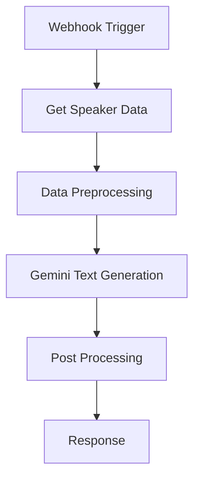

# n8n Workflows

このディレクトリには、**announce-workflow**プロジェクトで使用するn8nワークフローの設定ファイルとスクリプトが含まれています。

## ディレクトリ構成

```text
n8n/
├── workflows/
│   ├── README.md              # ワークフロー詳細説明
│   ├── workflow.json          # n8nワークフロー定義ファイル
│   ├── data_prosessing.js     # データ前処理スクリプト
│   └── post_processing.js     # 後処理スクリプト
```

## ワークフロー概要

### Speaker Announcement Workflow

登壇者情報の承認・公開を自動化するワークフローです。

#### 主な機能

1. **Webhook受信**: GASからの登壇者承認リクエストを受信
2. **データ取得**: Google Sheetsから登壇者情報を取得
3. **データ前処理**: WebhookデータとSheetsデータを統合・検証
4. **AI生成**: Geminiを使用してSNS投稿用コンテンツを生成
5. **後処理**: 生成されたコンテンツの整形・検証
6. **通知**: 処理結果の通知

#### ワークフローの流れ



## ファイル詳細

### workflow.json

n8nワークフローの完全な定義ファイルです。以下のノードが含まれています：

- **Webhook Trigger**: `speaker-approval`エンドポイント
- **Google Sheets**: 登壇者情報の取得
- **Code Nodes**: データ処理ロジック
- **Gemini AI**: コンテンツ生成
- **Response**: 結果の返却

### data_prosessing.js

データ前処理を行うJavaScriptコードです。

#### 主な処理

1. **入力データの分類**:
   - Webhookデータ（body, query, email/name）
   - Sheetsデータ（日本語カラム名または英語カラム名）

2. **データ統合**:
   - Webhookからのemailとnameを抽出
   - Sheetsデータとの照合・統合

3. **検証**:
   - 必須データの存在確認
   - データ形式の正規化

#### 入力形式

```javascript
// Webhookデータ
{
  "body": {
    "email": "speaker@example.com",
    "name": "Speaker Name"
  }
}

// Sheetsデータ
{
  "メールアドレス": "speaker@example.com",
  "お名前": "Speaker Name",
  "プロフィール": "Speaker profile..."
}
```

### post_processing.js

Gemini AIの出力を後処理するJavaScriptコードです。

#### 主な処理

1. **重複チェック**:
   - 処理スキップの判定
   - 理由の記録

2. **データ抽出**:
   - Gemini出力からテキストを抽出
   - 複数の出力形式に対応

3. **結果整形**:
   - 最終的なレスポンス形式への変換
   - メタデータの追加

#### 出力形式

```javascript
{
  "json": {
    "skip_processing": false,
    "speaker_data": {
      "email": "speaker@example.com",
      "name": "Speaker Name",
      "profile": "Speaker profile..."
    },
    "generated_content": {
      "twitter_post": "Generated Twitter post...",
      "linkedin_post": "Generated LinkedIn post..."
    },
    "workflow_metadata": {
      "trigger_time": "2024-01-01T00:00:00.000Z",
      "source": "webhook"
    }
  }
}
```

## デプロイ方法

### 1. n8nインスタンスへのインポート

1. n8nのWeb UIにアクセス
2. **Import from File**を選択
3. `workflow.json`をアップロード
4. ワークフローを有効化

### 2. 認証情報の設定

以下の認証情報をn8nで設定してください：

- **Google Sheets OAuth2**: Google Sheets APIへのアクセス
- **Gemini AI API**: Google AI Studio APIキー

### 3. Webhook URLの確認

ワークフロー有効化後、以下のURLが生成されます：

```
https://your-n8n-instance.com/webhook/speaker-approval
```

このURLをGASの設定で使用してください。

#### 設定項目

### 環境変数

n8nインスタンスで以下の環境変数を設定してください：

```bash
# Gemini AI設定
GOOGLE_AI_API_KEY=your-gemini-api-key

# Google Sheets設定（OAuth2を使用する場合は不要）
GOOGLE_SHEETS_API_KEY=your-sheets-api-key
```

### ワークフロー設定

#### Webhook設定

- **HTTP Method**: POST
- **Path**: `speaker-approval`
- **Response Mode**: Response Node

#### Google Sheets設定

- **Document ID**: 登壇者情報のスプレッドシートID
- **Sheet Name**: データが格納されているシート名
- **Authentication**: OAuth2（推奨）

#### Gemini AI設定

- **Model**: `gemini-1.5-flash`（推奨）
- **Temperature**: 0.7
- **Max Tokens**: 1000

## トラブルシューティング

### よくある問題

1. **Webhookが応答しない**
   - ワークフローが有効化されているか確認
   - Webhook URLが正しいか確認

2. **Google Sheetsアクセスエラー**
   - OAuth2認証が正しく設定されているか確認
   - スプレッドシートの共有設定を確認

3. **Gemini AIエラー**
   - APIキーが正しく設定されているか確認
   - API使用量制限に達していないか確認

### ログの確認

n8nの実行ログで以下の情報を確認できます：

- Webhook受信データ
- Sheetsデータ取得結果
- AI生成結果
- エラーメッセージ

## カスタマイズ

### 新しいワークフローの追加

1. `workflow.json`をコピーして新しいファイルを作成
2. ノードの設定を変更
3. 必要に応じてJavaScriptコードを修正
4. n8nにインポート

### データ処理ロジックの変更

`data_prosessing.js`と`post_processing.js`を編集して、データ処理ロジックをカスタマイズできます。

## セキュリティ

- **Basic認証**: n8nインスタンスへのアクセス制御
- **Webhook認証**: GASからのリクエスト検証
- **API認証**: Google SheetsとGemini AIの適切な認証設定

## 関連ドキュメント

- [Terraform設定](../terraform/README.md)
- [GAS設定](../gas/README.md)
- [プロジェクト全体のREADME](../README.md)
